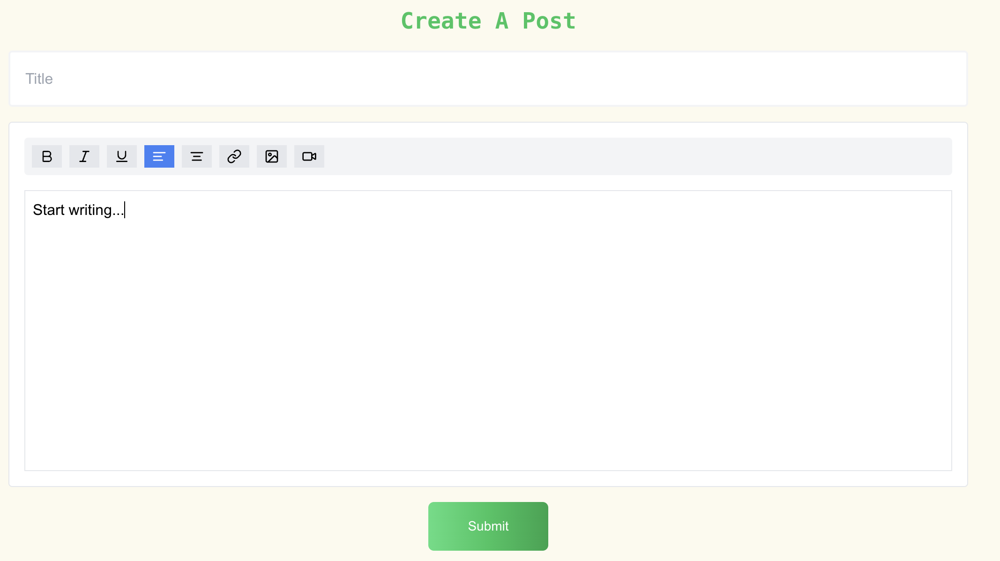
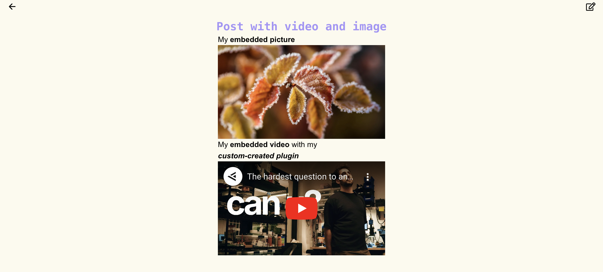
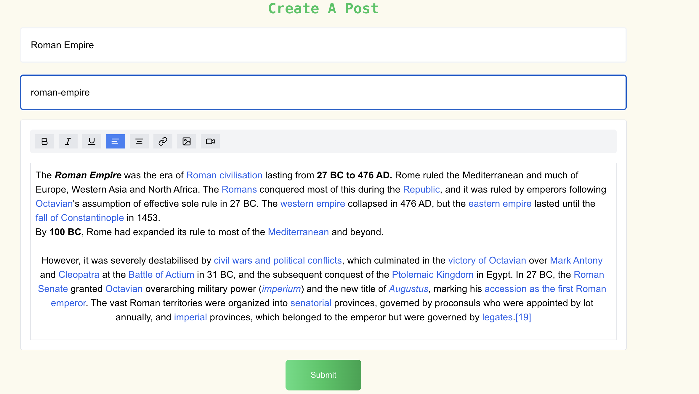

## Listing screen

Here we can get all the created post list from here we can `Add Post` and `Edit Post` and `Read Post` also we can `delete` the post from here.



## Create Post screen

Here we can create a new post where we can add `Title` and `Content` for the post.By using different editing tools and with our custom plugins we can edit the post as we want.


## Read Post screen

Here we can read the post which we have created.



## Edit Post screen

Here we can edit the `title` and `content` of the post.

# Creating Custom WYSIWYG EDITOR Plugins Guide

This guide explains how to create custom plugins for the WYSIWYG EDITOR, using a YOUTUBE VideoEmbed plugin as a practical example which we have added in our cms site. Learn how to extend WYSIWYG EDITOR's functionality with your own custom nodes and marks.

## Table of Contents
- [Understanding WYSIWYG EDITOR Plugin Types](#understanding-WYSIWYG EDITOR-plugin-types)
- [Creating a Custom Node Extension](#creating-a-custom-node-extension)
- [Step-by-Step: VideoEmbed Plugin](#step-by-step-videoembed-plugin)
- [Integration with Editor](#integration-with-editor)
- [Advanced Customization](#advanced-customization)
- [Best Practices](#best-practices)

## Understanding WYSIWYG EDITOR Plugin Types

WYSIWYG EDITOR offers several types of extensions:
1. **Nodes**: Block-level content (paragraphs, headings, videos)
2. **Marks**: Inline formatting (bold, italic)
3. **Extensions**: Additional functionality (shortcuts, commands)

### When to Use Each Type:
- Use **Nodes** when you need block-level elements
- Use **Marks** for inline text formatting
- Use **Extensions** for editor-wide functionality

## Creating a Custom Node Extension

Basic structure of a custom node:

```typescript
import { Node, mergeAttributes } from '@tiptap/core'

const CustomNode = Node.create({
  // 1. Name your node (required)
  name: 'customName',

  // 2. Configure group behavior
  group: 'block', // or 'inline'

  // 3. Define content behavior
  atom: true, // true for void nodes like videos
  inline: false, // true for inline nodes

  // 4. Define attributes
  addAttributes() {
    return {
      // your attributes here
    }
  },

  // 5. Define parsing rules
  parseHTML() {
    return [
      // your parsing rules
    ]
  },

  // 6. Define rendering rules
  renderHTML({ HTMLAttributes }) {
    return [
      // your rendering logic
    ]
  }
})
```

## Step-by-Step: VideoEmbed Plugin

Let's break down the VideoEmbed plugin creation:

### 1. Basic Setup

```typescript
const VideoEmbed = Node.create({
  name: 'videoEmbed',
  group: 'block',
  atom: true,
})
```

### 2. Adding Attributes

```typescript
addAttributes() {
  return {
    src: {
      default: null,
    },
    width: {
      default: '355',
    },
    height: {
      default: '200',
    },
  }
}
```

### 3. Defining HTML Parsing

```typescript
parseHTML() {
  return [
    {
      tag: 'div[data-type="video-embed"]',
    },
  ]
}
```

### 4. Implementing Rendering Logic

```typescript
renderHTML({ HTMLAttributes }) {
  const { src } = HTMLAttributes;
  
  // Helper function to extract YouTube ID
  const getYouTubeId = (url: string) => {
    const match = url.match(/(?:youtu\.be\/|youtube\.com\/(?:embed\/|v\/|watch\?v=|watch\?.+&v=))([^&?]+)/);
    return match ? match[1] : url;
  };

  // Helper function to create embed URL
  const getEmbedUrl = (url: string) => {
    if (url.includes('youtube')) {
      const videoId = getYouTubeId(url);
      return `https://www.youtube.com/embed/${videoId}`;
    }
    return url;
  };

  return ['div', 
    mergeAttributes(HTMLAttributes, { 'data-type': 'video-embed' }), 
    [
      'iframe',
      {
        src: getEmbedUrl(src),
        frameborder: '0',
        allowfullscreen: 'true',
        width: HTMLAttributes.width,
        height: HTMLAttributes.height,
      },
    ]
  ];
}
```

## Integration with Editor

### 1. Register the Plugin

```typescript
const editor = useEditor({
  extensions: [
    // ... other extensions
    VideoEmbed,
  ],
})
```

### 2. Add UI Controls

```typescript
const addVideo = () => {
  if (!editor) return;

  const url = window.prompt("Enter video URL (YouTube)");
  if (url) {
    editor.chain().focus().insertContent({
      type: 'videoEmbed',
      attrs: {
        src: url,
      },
    }).run();
  }
};

// Add button to toolbar
<button
  onClick={addVideo}
  className="px-2 py-1 bg-gray-200 hover:bg-gray-300"
>
  <Video size={16} />
</button>
```

## Advanced Customization

### 1. Adding Commands

```typescript
addCommands() {
  return {
    setVideo: (options) => ({ commands }) => {
      return commands.insertContent({
        type: this.name,
        attrs: options,
      })
    },
  }
}
```

### 2. Adding Keyboard Shortcuts

```typescript
addKeyboardShortcuts() {
  return {
    'Mod-Shift-v': () => this.editor.commands.setVideo(),
  }
}
```

### 3. Adding Input Rules

```typescript
addInputRules() {
  return [
    // Add custom input rules
  ]
}
```

## Best Practices

1. **Naming Conventions**
   - Use clear, descriptive names for your plugins
   - Follow the pattern: `feature-type` (e.g., `video-embed`)

2. **Attribute Management**
   - Always provide default values
   - Validate attribute values when necessary
   - Use TypeScript for better type safety

3. **Error Handling**
   - Implement proper error handling for URLs
   - Validate input before processing
   - Provide user feedback for failures

4. **Performance**
   - Use `atom: true` for void nodes
   - Implement proper cleanup in `destroy()`
   - Optimize rendering for large documents

5. **Accessibility**
   - Add proper ARIA attributes
   - Ensure keyboard navigation works
   - Provide alternative text where appropriate

## Example Usage

```typescript
// 1. Import the plugin
import { VideoEmbed } from './extensions/video-embed'

// 2. Configure the editor
const editor = useEditor({
  extensions: [
    StarterKit,
    VideoEmbed.configure({
      // Optional configuration
      allowFullscreen: true,
      defaultWidth: '355',
    }),
  ],
})

// 3. Use the plugin
editor.commands.setVideo({
  src: 'https://youtube.com/watch?v=...',
})
```

## Troubleshooting

Common issues and solutions:

1. **Plugin Not Rendering**
   - Check if the plugin is properly registered
   - Verify HTML structure in renderHTML
   - Check console for errors

2. **Attributes Not Working**
   - Verify attribute definitions
   - Check HTMLAttributes merging
   - Validate input data

3. **Parsing Issues**
   - Check parseHTML configuration
   - Verify HTML structure matches
   - Test with different input formats

## Contributing

When creating new plugins:

1. Document your code thoroughly
2. Add TypeScript types
3. Include usage examples
4. Test edge cases
5. Consider accessibility
6. Follow TipTap's conventions

---

This guide covers the basics of creating custom TipTap plugins. For more advanced usage or specific requirements, refer to the [TipTap documentation](https://tiptap.dev/docs/editor/introduction).